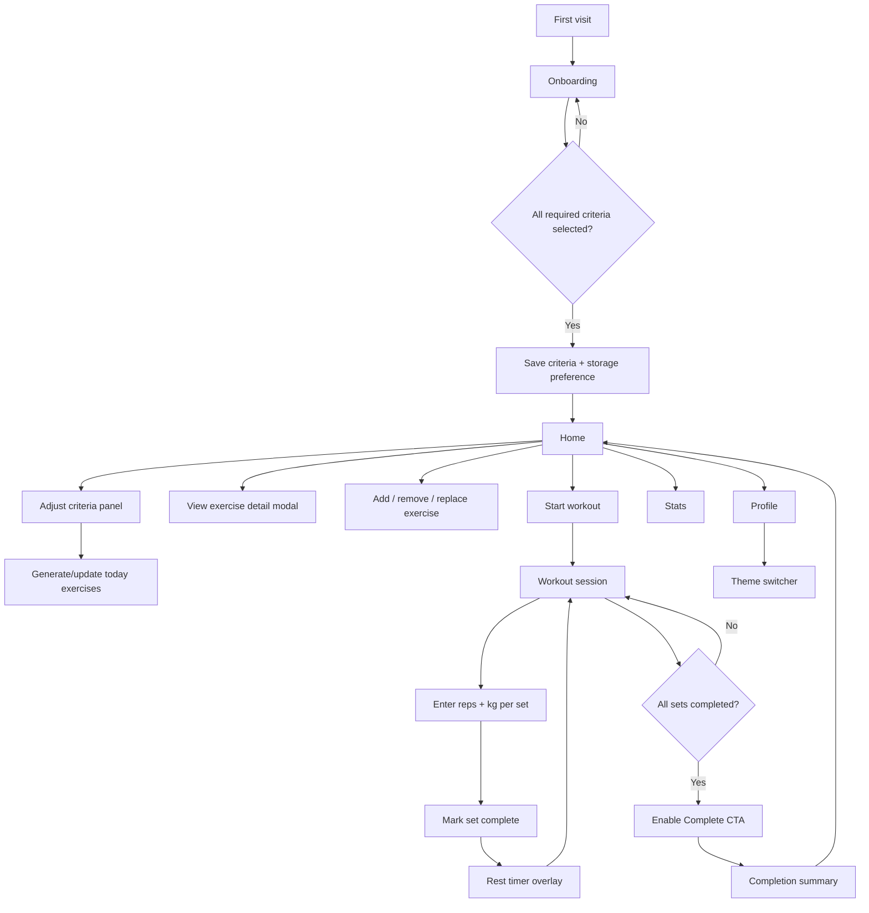

# NextFit Web Flow

Tài liệu này mô tả web flow hiện tại của NextFit dựa trên các màn hình:

- `source/apps/web/src/app/onboarding/page.tsx`
- `source/apps/web/src/app/page.tsx`
- `source/apps/web/src/app/workout/page.tsx`
- `source/apps/web/src/app/stats/page.tsx`
- `source/apps/web/src/app/profile/page.tsx`

Ghi chú: skill `ui-ux-pro-max` được dùng làm khung đánh giá UX/UI. Trong repo hiện tại chỉ có file `SKILL.md`, không có CLI `scripts/search.py`, nên phần design guidance bên dưới dựa trên checklist/rule-set của skill.

## 1. Product UX Summary

NextFit hiện là mobile-first workout planner/tracker với phong cách dark athletic UI. Trải nghiệm chính tập trung vào:

1. Thu thập tiêu chí cá nhân ban đầu.
2. Gợi ý danh sách bài tập hôm nay.
3. Cho phép chỉnh bài tập trước khi bắt đầu.
4. Theo dõi workout theo set, reps, kg, rest timer.
5. Hoàn tất buổi tập và quay về dashboard.
6. Xem thông tin cá nhân, theme và trạng thái thống kê.

Visual system hiện có hai lớp chưa hoàn toàn đồng bộ:

- Nhiều màn hình dùng accent xanh `#2979FF` trực tiếp.
- `THEME` mặc định trong `source/apps/web/src/lib/theme.ts` đang là `premium-athletic` với primary `#0FA560`.

Khuyến nghị: chọn một token primary làm source of truth rồi map các màn hình còn lại về token thay vì hardcode.

## 2. Route Map

| Route | Screen | Vai trò trong flow | Navigation |
| --- | --- | --- | --- |
| `/onboarding` | Onboarding | Thu thập thông tin ban đầu | Sau khi hoàn tất -> `/` |
| `/` | Home | Dashboard chính, chỉnh tiêu chí, danh sách bài tập hôm nay | Bottom nav, CTA -> `/workout` |
| `/workout` | Workout session | Theo dõi buổi tập đang diễn ra | Back/cancel -> `/`, complete -> completion state -> `/` |
| `/stats` | Stats | Empty state cho lịch sử và tiến trình | Bottom nav |
| `/profile` | Profile | Thông tin user criteria và theme switcher | Bottom nav, header profile link |

## 3. End-To-End Flow

## 4. State Model

Core state nằm trong `AppContext`:

| State | Ý nghĩa | Được dùng bởi |
| --- | --- | --- |
| `isFirstVisit` | Xác định lần đầu vào app | Onboarding, Home criteria panel |
| `cookiesAccepted` | Lưu lựa chọn storage/cookie | Onboarding, CookieConsent |
| `criteria` | Hồ sơ tập luyện của user | Onboarding, Home, Profile |
| `todayExercises` | Danh sách bài tập hôm nay | Home, Workout |
| `workoutStarted` | Cờ bắt đầu buổi tập | Home/Workout logic |
| `workoutCompleted` | Cờ hoàn tất buổi tập | Workout/session state |
| `exerciseProgress` | Progress theo bài/set | Context, hiện workout page đang dùng local state riêng |

Persist hiện tại:

- `localStorage("nextfit-state")` lưu `isFirstVisit`, `cookiesAccepted`, `criteria`.
- `todayExercises` và progress chưa được persist, nên refresh có thể mất trạng thái workout/danh sách đã chỉnh.

## 5. Screen Inventory

### 5.1 Onboarding

Mục tiêu: lấy nhanh thông tin cá nhân để cá nhân hóa lịch tập.

Input bắt buộc:

- Gender: `Nam`, `Nữ`, `Khác`
- Level: `Beginner`, `Intermediate`, `Advanced`, `Expert`
- Goal: `Strength`, `Hypertrophy`, `Endurance`
- Equipment: `Barbell`, `Dumbbell`, `Bodyweight`, `Cable`
- Duration: `15 min`, `30 min`, `45 min`, `60+ min`
- Frequency: `3 ngày`, `4 ngày`, `5 ngày`, `6 ngày`

Interaction:

- Single-select cho gender, level, goal, duration, frequency.
- Multi-select cho equipment.
- Checkbox lưu trữ thông tin.
- CTA tiếp tục chỉ nên active khi `canProceed` đúng.

UX notes:

- Copy hiện có câu "sát nhanh" nhiều khả năng là typo của "sát" hoặc "khảo sát"; nên sửa thành "khảo sát nhanh".
- Nên thêm progress indicator nhẹ vì đây là form dài trên mobile.
- Nên bảo đảm CTA fixed bottom không che nội dung cuối form.

### 5.2 Home

Mục tiêu: giúp user chọn/chỉnh tiêu chí và bắt đầu workout.

Main blocks:

- Header `TopHeader`
- Hero question: "Hôm nay bạn muốn tập gì?"
- Card "Quy trình chọn bài tập"
- Personalized plan card khi có `criteria`
- Returning user banner
- Criteria panel
- Exercise list
- Add exercise button
- Fixed CTA "Bắt Đầu Workout"
- `BottomNav`
- Exercise detail modal
- Cookie consent

Primary actions:

- Lưu tiêu chí.
- Add/remove/replace exercise.
- Reset today exercises.
- Start workout.

UX notes:

- Home vừa là setup screen vừa là dashboard; cần giữ hierarchy rõ: criteria là configuration, exercise list là output, start CTA là primary action.
- Toast hiện có dùng ký tự biểu tượng trong text. Theo `ui-ux-pro-max`, structural icons nên là SVG/lucide; nếu toast cần trạng thái, nên dùng icon component + text.
- CTA fixed bottom và bottom nav đang cùng tồn tại; cần kiểm tra spacing để list không bị che.

### 5.3 Workout

Mục tiêu: hỗ trợ user ghi nhận set trong lúc tập.

Main blocks:

- Sticky top bar: cancel/back, title, pause/play.
- Progress bar theo completed sets.
- Exercise cards.
- Set rows gồm set index, reps input, kg input, rest badge, check button.
- Add set per exercise.
- Fixed bottom actions: cancel + complete.
- Rest timer overlay.
- Exercise modal.
- Completion summary state.

Interaction:

- Timer tăng mỗi giây khi không pause.
- Mark set complete -> disable reps/kg input -> mở rest timer.
- Complete CTA chỉ active khi tất cả set completed.
- Cancel workout -> reset state -> `/`.
- Completion summary -> `/`.

UX notes:

- Nên có confirm dialog khi cancel workout vì đây là hành động mất progress.
- Reps/kg input đang không có label trực tiếp, chỉ có header; cần kiểm tra screen reader. Có thể thêm `aria-label`.
- Check button nên có `aria-label` theo bài và set.
- Completion headline đang dùng emoji trong text. Nếu giữ visual celebration, nên thay bằng icon/illustration nhất quán.
- Workout page đang quản lý set state local, trong khi context có `exerciseProgress`; nên cân nhắc hợp nhất để hỗ trợ resume/refresh.

### 5.4 Stats

Mục tiêu hiện tại: placeholder cho lịch sử workout và tiến trình.

Current state:

- Empty state centered.
- Icon `BarChart2`.
- Message: "Lịch sử buổi tập và tiến trình của bạn sẽ hiển thị tại đây."

Future UX:

- Khi chưa có workout: empty state nên có CTA "Bắt đầu buổi tập".
- Khi có dữ liệu: ưu tiên các chart dễ đọc trên mobile:
  - Weekly workout count: bar chart.
  - Volume trend: line chart.
  - Muscle group distribution: horizontal bar, tránh donut nếu nhiều hơn 5 nhóm.
  - Recent sessions: list/table compact.

### 5.5 Profile

Mục tiêu: xem hồ sơ tập luyện và đổi theme.

Main blocks:

- Avatar placeholder.
- Name "Gymer NextFit".
- Level + goal summary.
- Info card: gender, level, goal.
- `ThemeSwitcher`.
- Bottom nav.

UX notes:

- Profile chỉ hiển thị một phần criteria; nên bổ sung equipment, duration, frequency nếu đây là nơi user xác nhận hồ sơ.
- Nếu cho sửa criteria từ Profile, nên deep-link hoặc mở cùng criteria panel của Home để tránh hai luồng chỉnh khác nhau.
- ThemeSwitcher dùng token theme, nhưng nhiều màn hình vẫn hardcode màu xanh; cần đồng bộ để switch theme có hiệu lực toàn app.

## 6. Navigation Model

Primary navigation:

- Bottom nav có 4 item: Home, Workout, Stat, Profile.
- Mỗi item có icon + label, phù hợp rule bottom nav tối đa 5 items.
- Active state dùng primary color.

Secondary navigation:

- Header profile shortcut ở `TopHeader`.
- Workout top bar có cancel/back và pause/play.
- Exercise detail mở modal từ Home/Workout.

Navigation recommendations:

- `/workout` là session route. Nếu user chưa start workout hoặc không có exercises, nên redirect về `/` hoặc show empty state có CTA.
- Khi cancel workout, nên hỏi xác nhận.
- Khi back từ modal, focus nên trả về card/button đã mở modal.
- Route `/stats` và `/profile` nên giữ bottom nav nhất quán như hiện tại.

## 7. Visual Design Direction

Current direction:

- Dark mobile app.
- High contrast text.
- Rounded cards and controls.
- Accent blue for selected/active/primary states.
- Dense but readable workout tracking UI.

Recommended product style:

- `Premium Athletic`: calm, performance-focused, high legibility.
- Avoid overly decorative gradients/orbs.
- Use restrained surfaces: dark background, slightly elevated cards, clear active state.
- Use lucide icons consistently.

Token alignment target:

| Role | Current common value | Recommended |
| --- | --- | --- |
| App background | `#000000` | Token: `bg.dark` |
| Card surface | `#0F0F14` / `#131315` | Token: `bg.primary` |
| Primary action | `#2979FF` and `#0FA560` | Pick one `primary` token |
| Text primary | `#E0E0E0` / `#F5F5F7` | Token: `text.primary` |
| Text secondary | `#6B6B7A` / `#A1A1A6` | Token: `text.secondary` |
| Border subtle | rgba white 0.06-0.08 | Token: `border.subtle` |

## 8. Accessibility & Interaction Checklist

Critical checks:

- All icon-only buttons need `aria-label`: profile shortcut is covered; workout check/cancel/pause buttons should be checked.
- Minimum touch target should be at least 44x44px. Some workout check buttons are `32x32`; visual size can stay compact, but hit area should be expanded.
- Inputs need accessible labels, especially workout reps/kg fields.
- Focus rings should be visible on all buttons/links/inputs.
- Do not rely on color alone for selected/completed states; check icons/text already help in most places.
- Toast should use `aria-live="polite"` and avoid stealing focus.
- Modals/overlays should trap focus and close with Escape.

Interaction polish:

- Press feedback is already present via `active:scale-*`; keep it subtle and consistent.
- Use 150-300ms transitions for selection, modal open/close, rest timer overlay.
- Respect `prefers-reduced-motion` for scale/glow/animation.

## 9. Responsive Behavior

Current implementation is primarily mobile-first. Recommended breakpoints:

| Width | Behavior |
| --- | --- |
| 375px | Single column, bottom nav, fixed CTA, compact cards |
| 768px | Wider gutters, two-column cards where useful |
| 1024px+ | Consider sidebar nav or centered app shell, avoid stretching form/card widths too far |

Specific checks:

- Fixed CTA on Home plus BottomNav must reserve bottom padding in content.
- Workout fixed bottom action area must not cover last set row.
- Long exercise names should wrap cleanly without pushing badges/buttons off-screen.
- Avoid horizontal scroll from flex rows with inputs.

## 10. UX Priority Backlog

P0:

- Unify primary color and theme token usage across Onboarding, Home, Workout, Stats, Profile.
- Add accessible labels for workout controls and reps/kg inputs.
- Add confirm dialog before canceling workout.
- Ensure fixed bottom CTA/action areas do not hide scroll content.

P1:

- Persist active workout progress or warn before refresh/navigation.
- Replace emoji/status text in toast/completion with lucide icons or designed visual assets.
- Add onboarding progress indicator.
- Add empty-state CTA in Stats.
- Show more criteria in Profile: equipment, duration, frequency.

P2:

- Add completed workout history and basic charts in Stats.
- Add route guards for `/workout`.
- Standardize copy language between English workout terms and Vietnamese UI labels.
- Add reduced-motion handling for scale/glow animations.

## 11. Suggested Information Architecture

Top-level:

- Home: plan and start today's workout.
- Workout: active session only.
- Stats: progress and history.
- Profile: criteria, preferences, theme.

Modals/sheets:

- Exercise detail modal.
- Rest timer overlay.
- Confirm cancel workout dialog.
- Optional criteria edit sheet on Home/Profile.

## 12. Acceptance Criteria For Current Flow

- First-time user can complete onboarding and land on Home.
- Returning user sees saved criteria summary.
- User can update criteria and regenerate today's exercise list.
- User can add/remove/replace exercises before workout.
- User can start workout and track all sets.
- Rest timer appears after completing a set and can be completed/skipped.
- Complete button remains disabled until all sets are complete.
- Completion summary returns user to Home.
- Bottom nav consistently reaches Home, Workout, Stats, Profile.
- Profile reflects saved criteria and allows theme switching.
